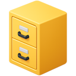
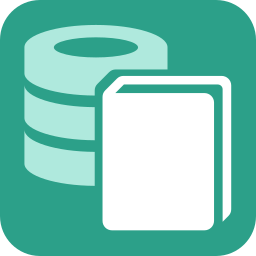

## Apps

<table>
<tr>
<td align="center"></td>
<td><a href="https://github.com/brianluft/heirloom"><b>Heirloom apps</b></a></td>
<td>Lightly modernized Program Manager and File Manager for Windows</td>
</tr>
<tr>
<td align="center"></td>
<td><a href="https://github.com/brianluft/jackpot"><b>Jackpot Media Library</b></a></td>
<td>Personal video hub powered by Backblaze B2 cloud storage</td>
</tr>
<tr>
<td align="center"></td>
<td><a href="https://github.com/brianluft/social-media-translator"><b>Social Media Translator</b></a></td>
<td>Translate foreign language videos and screenshots</td>
</tr>
<tr>
<td align="center"></td>
<td><a href="https://github.com/brianluft/sqlnotebook"><b>SQL Notebook</b></a></td>
<td>Casual data exploration in SQL</td>
</tr>
<tr>
<td align="center"></td>
<td><a href="https://github.com/brianluft/threadloaf"><b>Threadloaf</b></a></td>
<td>Browser extension to add a threaded view to Discord</td>
</tr>
<tr>
<td align="center"></td>
<td><a href="https://github.com/tmbasic/tmbasic"><b>TMBASIC</b></a></td>
<td>Programming language for writing non-graphical programs</td>
</tr>
</table>

## Utilities

<table>
<tr>
<td align="center"></td>
<td><a href="https://github.com/brianluft/heirloom"><b>Arcadia MCP Server</b></a></td>
<td>Workarounds for Cursor issues on Windows</td>
</tr>
</table>
