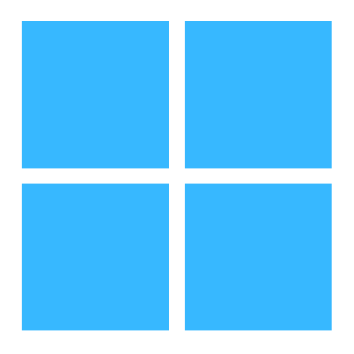

<h2>Applications</h2>

<a href="https://github.com/brianluft/heirloom"><b>Heirloom apps</b></a>&nbsp;&nbsp;&nbsp; Lightly modernized Program Manager and File Manager
  

<a href="https://github.com/brianluft/jackpot"><b>Jackpot Media Library</b></a>&nbsp;&nbsp;&nbsp; Personal video hub powered by Backblaze B2 cloud storage
  

<a href="https://github.com/brianluft/sqlnotebook"><b>SQL Notebook</b></a>&nbsp;&nbsp;&nbsp; Casual data exploration in SQL
  

<a href="https://github.com/tmbasic/tmbasic"><b>TMBASIC</b></a>&nbsp;&nbsp;&nbsp;&nbsp;&nbsp; Programming language for writing non-graphical programs</td>

<h2>Libraries</h2>

<a href="https://github.com/brianluft/terminalforms"><b>Terminal Forms</b></a>&nbsp;&nbsp;&nbsp;&nbsp;&nbsp; Terminal user interface framework for .NET based on Turbo Vision

<h2>Utilities</h2>

<a href="https://github.com/brianluft/arcadia"><b>Arcadia MCP Server</b></a>&nbsp;&nbsp;&nbsp; Workarounds for Cursor issues
